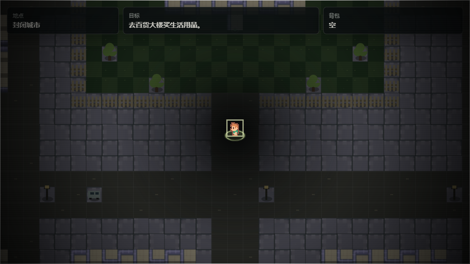

# 微恐俯视角剧情游戏框架

这是一个 Electron 桌面应用骨架，内容层是纯 HTML/CSS/JS 的 2D 俯视角剧情游戏。可以开发时直接跑窗口，发布时打包成 Windows `.exe` 和 macOS `.dmg` / `.app`。



当前流程：开始菜单进入游戏后黑屏显示“序章”；主角在旧教堂醒来，与老人对话得知日期是 1999 年 12 月 31 日；走出教堂后黑屏显示“第一章”，随后进入城市地图。第一章第一幕主线是去百货大楼买生活用品，然后回光明大学。城市边缘已用警戒线封闭，碰到边缘会提示“此城市已封闭”。

## 操作

- `WASD` / 方向键：移动
- `E` / 空格：互动、推进对白
- `Shift`：慢走
- `J`：打开记录

## 桌面应用

需要先安装 Node.js 20+，安装 Node.js 时会自带 `npm`。

先安装依赖：

```bash
npm install
```

开发运行：

```bash
npm run dev
```

打包 Windows：

```bash
npm run dist:win
```

打包 macOS：

```bash
npm run dist:mac
```

产物会输出到 `release/`。通常 Windows 包在 Windows 上构建，macOS 包在 Mac 上构建；仓库里也放了 `.github/workflows/build-desktop.yml`，可以在 GitHub Actions 里分别构建两边的包。

## Unity 工程

Unity 版工程在 `UnityGame/`。用 Unity Hub 打开这个目录即可。

可玩的 Unity 场景在 `UnityGame/Assets/Scenes/Main.unity`。工程打开时会自动尝试切到这个场景；如果 Unity 仍停在 `Untitled`，在 Project 面板里双击 `Assets/Scenes/Main` 即可。按播放后会出现开始菜单、序章、教堂和第一章城市。

核心 Unity 逻辑在 `UnityGame/Assets/Game/Scripts/UnityPrototypeGame.cs`，目前用脚本生成像素风占位地图、主角、老人、警戒线和第一章第一幕任务。`UnityGame/Assets/Editor/CreatePlayableScene.cs` 可以通过 Unity 菜单 `Tools/Old Church/Rebuild Playable Scene` 重新生成主场景。

现有 HTML/Electron 原型也保留并导入到 `UnityGame/Assets/ImportedPrototype/`，包括 `src`、`assets`、桌面入口文件和预览图。`node_modules` 和 Unity 的生成缓存不会提交到仓库。

## 素材来源

当前像素素材使用 Kenney 的 RPG Urban Pack，许可为 Creative Commons Zero (CC0)，可用于个人、学习和商业项目。

- 素材页：https://www.kenney.nl/assets/rpg-urban-pack
- 许可文件：`assets/vendor/kenney-rpg-urban/raw/License.txt`

## 怎么填内容

主要改 `src/content.js`：

- `rooms`：添加房间、地图、出口、可交互物。
- `dialogues`：添加对白、选择、剧情记录。
- `items`：添加道具。
- `flags`：添加剧情开关，用来控制门、事件、分支。

地图字符含义：

- `#`：墙体，不能通行。
- `.`：地面。
- `A`：祭坛。
- `B`：长椅。
- `D`：出口。
- `N`：NPC。
- `!`：城市边缘警戒线，不能通行。
- `=`：道路。
- `,`：草地。
- `~`：水面。
- `S/L/V/Y/Q/O`：城市装饰物。真正的交互逻辑由 `interactables` 和 `exits` 决定。
- 城市建筑招牌在 `rooms.city.labels` 里配置，当前包含新华书店、录像厅、红星商场、百货大楼、光明大学等位置。

一个可交互物示例：

```js
{
  id: "elder",
  x: 9,
  y: 5,
  label: "和老人说话",
  dialogue: "elderIntro"
}
```

一个出口示例：

```js
{
  id: "churchDoor",
  x: 9,
  y: 10,
  label: "走出教堂",
  requiredFlag: "spokeToElder",
  lockedDialogue: "elderFirst",
  targetRoom: "city",
  targetSpawn: "churchGate",
  chapterCard: "chapterOne"
}
```

后续可以继续扩展：

- 存档/读档
- 追逐或潜行事件
- 更多地图层，如遮挡、脚步声区域、触发区域
- 角色立绘和像素图资源
- 剧情编辑器或 JSON 数据加载
